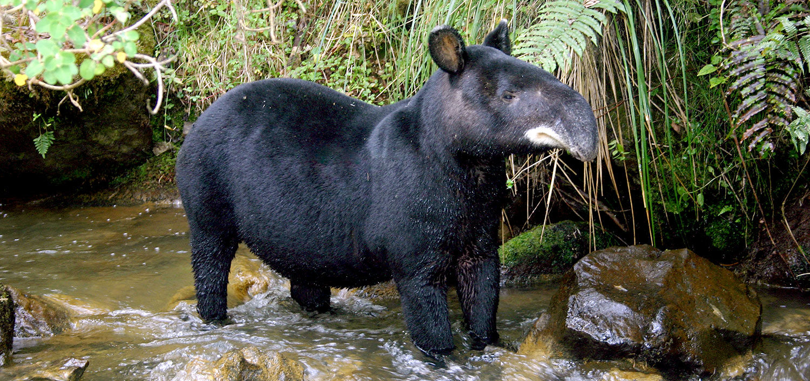

---
output:
  pdf_document: default
  html_document: default
---
# Our Example: {#example}

The data set that we are going to simulate mimics the spatial and temporal way in which we imagine the repeated measures of presence-absence in ecology originate. Which are a combination of an ecological process and an observation process. The first process contains the mechanisms under which Spatio-temporal distribution patterns originate, while the second process contains the different facets in which sources of error originate when taking the data.

To be more concrete we are going to call our imaginary species by a real name. We will call it the Mountain Tapir (_Tapirus pinchaque_), a large and conspicuous mammal, distributed from Colombia to Ecuador and Northern Peru, and listed as endangered in terms of [conservation](https://www.iucnredlist.org/species/21473/45173922).


Mountain tapir in "Los Nevados" National Park. Colombia

Though it is the smallest (and furriest!) of tapir species, the Mountain tapir is the largest mammal in the tropical Andes mountain range. Their long hair is brownish to black, and their lips are lined in a white color.


The data set contains _J_ replicated data of detection or non-detection of the species in _M_ sites, taking into account that we assume that it is a closed population ('closure' assumption). This means that during the sampling there were no changes due to births, deaths, immigration or emigration. In other words, the sampling was short in time and the occurrence of species _z_ did not change due to demographic effects.  

Clearly, we must distinguish two processes, the first is the ecological process, which generates (partially) a latent state of the occurrence _z_. The second is the observation process, which produces the observed tapir detection or non-detection data. Here we assume that the observation process is governed by an imperfect detection mechanism. In other words, some tapir could have escaped my observation, which generates false negatives. We also assume that false positives are absent, meaning that anything I identify as a tapir is indeed a tapir and not a deer or a bear. To make the example more realistic, we include the effects of elevation (altitude) and forest cover on occurrence, as factors that affect occurrence linearly, decreasing it in the case of elevation, and increasing occupation linearly in the case of forest cover. In the end the two variables interact negatively with each other. These effects are introduced in the logarithmic scale occurrence as a generalized linear model (GLM) is traditionally done.


In our simulation we are going to make it explicit that it is not possible to detect all the tapirs from a sample site, so we are facing a type of error that makes us underestimate the abundance of the population. There are many reasons why we fail to spot an individual in the wild, it can be because we got distracted while the tapir passed by, because the binoculars did not have enough magnification, or simply because the tapir hid behind a tree upon smelling us, or because some other reason. In this way, we are going to register the presence (_z_=1) with a probability of detection _p_ which we are also going to make dependent (on the logarithmic scale) of the elevation and of a co-variable that affects the detection, the temperature. In general terms, animals are more difficult to observe when the temperature is higher, and generally the higher the elevation, the lower the temperature. In this way, we assume that detection is negatively related to elevation and temperature. But it should also be noted that the negative effect on _p_ can also be mediated by a decrease in abundance with elevation, which also causes the probability of occupancy to decrease with elevation. Note that a co-variable, elevation affects both the ecological process (the occurrence) and the observational process (the probability of detection). This has a purpose and is likely to happen in nature many times. Occupancy models have a “mechanistic” basis producing a spatial variation in abundance. That is, we will have sites with greater abundance and others with less abundance. But hierarchical models, like the one we are about to build, are capable of unraveling these complex relationships between occurrence and probability of detection [@Kery2008; @KERY2008; @Kery2012]. Finally, for this first example, we are going to leave out the effect of the interaction between elevation and temperature, setting it to zero. Then we can vary this parameter to consider that effect. In summary, we are going to generate data under the following model, where the sites are indexed as _i_ and the repeated counts on the site are going to be referred to as _j_.


### Ecological Model:

\begin{equation} 
z _{i} = Bernoulli (\psi _{i})
  (\#eq:binom)
\end{equation}

\begin{equation} 
logit(\psi _{i}) = \beta _{0} + \beta _{1} \ast Elevation _{i} + \beta _{2}\ast CovForest _{i} + \beta _{3} \ast Elevation _{i} \ast CovForest _{i}
  (\#eq:binom)
\end{equation}


### Observation Model:

\begin{equation} 
y _{ij} = Bernoulli (z _{i} * p _{ij})
  (\#eq:binom)
\end{equation}

\begin{equation} 
logit(p _{ij}) = \alpha  _{0} + \alpha  _{1} \ast Elevation _{i} + \alpha  _{2}\ast Temperature _{ij} + \alpha _{3} \ast Elevation _{i} \ast Temperature _{ij}
  (\#eq:binom)
\end{equation}

Where $\psi$ is the occupancy and _p_ the probability of detection. With $\beta$ as the regression coefficient for the occupancy covariates and $\alpha$ the regression coefficient for the detection covariates.

We are going to generate data from the “inside out” and from the top down. For this, we first choose the sample size and create the values for the covariates. Second, we select the values of the ecological model parameters (the occupancy) and assemble the expected occurrence (the parameter $\psi$, occupancy) and then obtain the random variable _z_ which has a Bernoulli distribution. Third, we select the values of the parameters of the observation model (the detection), to assemble the probability of detection _p_ and obtain the second set of a random variable _y_ (observed or unobserved detection of a tapir) which also has distribution Bernoulli.


To simulate the data we will use the statistical programming language R [@RCoreTeam2016], which provides a wide variety of graphical and statistical modeling techniques and a large ecosystem of packages for statistical and ecological analysis. If you haven't already, download and install [R](http://www.r-project.org/) on your computer, then do the same with [RStudio.](http://www.rstudio.com /)

## Initial steps: sample size and covariate values

Start [RStudio](http://www.rstudio.com/), copy, paste and execute the commands in the gray window.

We first choose the sample size, the number of sites, and the number of repeated measures (number of visits) of presence/absence at each site.

```{r primer,cache=TRUE}
M <- 60 # Number of spatial replicas (sites)
J <- 30 # Number of temporal replicas (repeat counts)
```


We then create the values for the covariates. We have elevation and forest cover as co-variables for each site. They differ from site to site but for each sampling, they are the same. While the temperature is a co-variable of the observation, so it does vary in each sampling and also in each site. Remember that the sub-index _i_ refers to the site and the _j_ to each sampling. To keep things simple our covariates are going to have a normal distribution with a mean-centered at zero and not going to extend very far on either side of zero. In real data analysis, we will have to standardize the co-variables to avoid numerical problems of difference in the scales of the co-variables and to be able to calculate the value of maximum likelihood (ML), as well as to obtain convergence in the Markov chains of the Bayesian model. Here we are going to ignore a fact of real life, and that is that the co-variables are not totally independent of each other, that is, in nature, forest cover can be related to elevation, but this is not going to be relevant, for now.  

To initialize the random number generator and always get the same results we can add the following line:

```{r seed1, echo=TRUE,cache=TRUE,warning=FALSE}
set.seed(24) # Can choose seed of your choice
```

In this way, we can always obtain the same estimates. But then when we want to get the sampling error we will have to remove that line. For this example, we will generate values already standardized for the covariates, which are centered at zero and ranging from -1 to 1.

```{r covs1, echo=TRUE,cache=TRUE}
elev <- runif(n = M, -1, 1)             # Scaled elevation of a site
forest <- runif(n = M, -1, 1)           # Scaled forest cover at each site
temp <- array(runif(n = M*J, -1, 1), dim = c(M, J)) # Scaled temperature
```

## Simulating the ecological process and its result: The Occurrence of The Tapir

To simulate the occurrence of tapirs at each site, we choose the values for the parameters that govern the spatial variation in occurrence $β_{0}$ to $β_{3}$. The first parameter is the expected average occurrence of tapir (occupation probability) when all covariates have a value of zero, in other words the intercept of the occurrence model. We prefer to think of tapirs in terms of their occurrence rather than logit (occurrence). Here we choose the occupancy intercept first and then transform it from the logarithmic scale with the logit link function.

```{r psi_effect1, echo=TRUE,cache=TRUE}
mean.occupancy <- 0.60         # Mean expected occurrence of tapir
beta0 <- plogis(mean.occupancy) # Same on logit scale (= logit-scale intercept)
beta1 <- -2                    # Effect (slope) of elevation
beta2 <- 2                     # Effect (slope) of forest cover
beta3 <- 1                     # Interaction effect (slope) of elev and forest
```

Here we apply the linear model (to the logarithmic scale) and obtain the logit transformation of the occupancy probability, which we invert with the logit transformation to obtain the tapir occupancy and plot everything.

```{r fig2, echo=TRUE, cache=TRUE, fig.cap="Two ways to show the relationship between the probability of occurrence of tapir and the covariates. (A) Relationship between psi and elevation for a constant value (mean equal to zero) of forest cover. (B) Relationship between psi and elevation in an observed value of forest cover. (C) Forest cover psi ratio for a constant elevation (at mean zero). (D) Relationship psi forest cover for the observed value of elevation.", warning=FALSE, fig.show='asis'}
logit.psi <- beta0 + beta1 * elev + beta2 * forest + beta3 * elev * forest
psi <- plogis(logit.psi)      # Inverse link transformation

# par()              # view current settings
opar <- par()      # make a copy of current settings
par(mfrow = c(2, 2), mar = c(5,4,2,2), cex.main = 1)
curve(plogis(beta0 + beta1*x), -1, 1, col = "red", frame.plot = FALSE, ylim = c(0, 1),
      xlab = "Altitud", ylab = "psi", lwd = 2)
text(0.9, 0.95, "A", cex = 1.5)
plot(elev, psi, frame.plot = FALSE, ylim = c(0, 1), xlab = "Altitud", ylab = "")
text(0.9, 0.95, "B", cex = 1.5)
curve(plogis(beta0 + beta2*x), -1, 1, col = "red", frame.plot = FALSE, ylim = c(0, 1), 
      xlab = "Forest cover", ylab = "psi", lwd = 2)
text(-0.9, 0.95, "C", cex = 1.5)
plot(forest, psi, frame.plot = FALSE, ylim = c(0, 1), xlab = "Forest cover", ylab = "")
text(-0.9, 0.95, "D", cex = 1.5)
# dev.off()
par(opar)          # restore original par settings
```


To better show the joint relationship between the two covariates and psi, we need to make a surface plot. Here we have not changed anything about the simulation, we have only added more data to it to better visualize it.  

```{r fig3, cache=TRUE, fig.cap="Relationship constructed between the simulated data of the expected occurrence (occupation) of tapir (psi) represented with the color scale from gray to red, against elevation and forest cover simultaneously. In this case the interaction between the two covariates is given by the value of beta3 = 1 that we have established previously.", fig.scap="fig3", warning=FALSE, fig.show='asis'}
# Compute expected occurrence for a grid of elevation and forest cover
cov1 <- seq(-1, 1, , 100)                       # Values for elevation
cov2 <- seq(-1, 1, , 100)                       # Values for forest cover
psi.matrix <- array(NA, dim = c(100, 100))      # Prediction matrix, for every 
# combination of values of elevation and forest cover

for(i in 1:100){
   for(j in 1:100){
      psi.matrix[i, j] <- plogis(beta0 + 
                                   beta1 * cov1[i] + 
                                   beta2 * cov2[j] + 
                                   beta3 * cov1[i] * cov2[j] )
   }
}

mapPalette <- colorRampPalette(c("grey", "yellow", "orange", "red"))
image(x = cov1, y = cov2, z = psi.matrix, col = mapPalette(100), xlab = "Altitud", 
      ylab = "Forest cover", cex.lab = 1.2)
contour(x = cov1, y = cov2, z = psi.matrix, add = TRUE, lwd = 1)
matpoints(elev, forest, pch="+", cex=0.8)


```


So far we have not introduced any stochastic variation in the relationship between tapir occurrence and covariates. To do this we must make use of some statistical models, or statistical distributions, to describe the random variability around the expected value of psi. The typical way to introduce this random variation is to obtain the occurrence of tapir at each site _i_, $z _{i}$, from a Bernoulli distribution with the expected values ($\psi _{i}$).  

### Why Bernoulli?

In the ecological process $z _{i}$ tapir occurrence is represented by a Bernoulli-type distribution where tapir is present at a site represented as the occupancy $\psi$ at a site where it is present, or not present 1-$\psi$. The Bernoulli distribution is a special case of the binomial distribution, and its best example is a single toss of a coin. If you require a more extensive, basic, detailed explanation and with more examples, I recommend you visit [khanacademy.](https://www.khanacademy.org/math/statistics-probability/random-variables-stats-library/binomial-mean-standard-dev-formulas/v/mean-and-variance-of-bernoulli-distribution-example) 


```{r expect, cache=TRUE, warning=FALSE}
z <- rbinom(n = M, size = 1, prob = psi)  # Realised occurrence. A Bernoulli
sum(z)                                    # Total number of occupied sites
table(z)                                  # Frequency distribution of tapir occurrence
```

Here we have created the result of the ecological process: site-specific occurrence $z _{1}$. We see that 20 sites are not occupied and the remaining 40 sites are occupied


## Simulating the observation process and its result: the detection

Occurrence _z_ is not what we normally see, as there is a chance that we will fail to observe an individual. Hence there is a binary measure of error when we measure occurrence (we observe it or we don't observe it). We assume that we can make only one of the two possible sightings (yes, no), but we may have missed a tapir sighting somewhere, so the probability of detection is less than one, and the error measure is affected by coverage. of forest and temperature. Keep in mind that we will never register the presence of a tapir when in fact there are no tapir. In other words, we are assuming that we have no false positives. To make it explicit that we have an interaction effect between two covariates in our data, we are going to allow an interaction effect in the code, but set it to zero and thus have no effect in the model that generates the data. We first select the values for $\alpha _{0}$ to $\alpha _{3}$, where the first is the probability of detection for the tapir, on the logit scale, when all detection covariates have a value of zero. We have chosen the intercept of the detection model and then transformed it with the plogis link function. This is not the same as the average detection probability, which is higher in our simulation model, as we will see later.


```{r p_effec, cache=TRUE, warning=FALSE}
mean.detection <- 0.3            # Mean expected detection
alpha0 <- qlogis(mean.detection) # same on logit scale (intercept)
alpha1 <- -1                     # Effect (slope) of elevation
alpha2 <- -3                     # Effect (slope) of temperature
alpha3 <- 0                      # Interaction effect (slope) of elevevation and temperature
```

Applying the linear model, we have the logit of the detection probability of the tapir for each site and sampling, and applying the inverse transformation (plogis), we obtain a matrix of dimensions 60 by 30 with the probability of detection for each site _i_ and sampling _j_. Finally, we plot the relationships for the probability of detection in the data.  


```{r fig4, cache=TRUE, warning=FALSE, fig.cap="Two ways to show the relationships between the expected detection probability of the tapir (_p_) and the two variables elevation and temperature. (A) Relationship _p_ and elevation for constant temperature (at the mean value, which is equal to zero). (B) Relationship between _p_ and elevation in the observed value of temperature quantity. (C) Relationship between _p_ and temperature for a constant value of elevation (at mean elevation equal to zero). (D) Relationship between _p_ and temperature for an observed value of elevation.", fig.scap="fig4", warning=FALSE, fig.show='asis'}

logit.p <- alpha0 + alpha1 * elev + alpha2 * temp + alpha3 * elev * temp
p <- plogis(logit.p)             # Inverse link transform 
mean(p)                          # average per-site p is about 0.39

par(mfrow = c(2, 2), mar = c(5,4,2,2), cex.main = 1)
curve(plogis(alpha0 + alpha1*x), -1, 1, col = "red", frame.plot = FALSE, ylim = c(0, 1.1), 
      xlab = "Altitud", ylab = "p", lwd = 2)
text(-0.9, 1.05, "A", cex = 1.5)
matplot(elev, p, pch = "*", frame.plot = FALSE, ylim = c(0, 1.1), xlab = "Altitud", 
        ylab = "")
text(-0.9, 1.05, "B", cex = 1.5)
curve(plogis(alpha0 + alpha2*x), -1, 1, col = "red", frame.plot = FALSE, ylim = c(0, 1.1), 
      xlab = "Temperature", ylab = "p", lwd = 2)
text(-0.9, 1.05, "C", cex = 1.5)
matplot(temp, p, pch = "*", frame.plot = FALSE, ylim = c(0, 1.1), xlab = "Temperature", 
        ylab = "p")
text(-0.9, 1.05, "D", cex = 1.5)

```


In a similar way we are going to produce a graph of a surface with the joint relationship between elevation, temperature and the probability of detection of the tapir (_p_), acting simultaneously. The relationship on the logarithmic scale is represented by a sloped plane that represents the interaction between elevation and forest cover.

```{r fig5, cache=TRUE, fig.cap="Relationship constructed between the simulated data of the expected probability of detection (detectability) of tapir (p) represented with the color scale from gray to red, against elevation and temperature simultaneously. In this case, the interaction between the two covariates has a linear relationship that is given by the value of alpha3 = 0 that we have previously established.", fig.scap="fig5", warning=FALSE, fig.show='asis'}
# Compute expected detection probability for a grid of elevation and temperature
cov1 <- seq(-1, 1,,100)                  # Values of elevation
cov2 <- seq(-1,1,,100)                   # Values of temperature
p.matrix <- array(NA, dim = c(100, 100)) # Prediction matrix which combines 
# every value in cov 1 with every other in cov2
for(i in 1:100){
   for(j in 1:100){
      p.matrix[i, j] <- plogis(alpha0 + alpha1 * cov1[i] + 
                                 alpha2 * cov2[j] + 
                                 alpha3 * cov1[i] * cov2[j])
   }
}
image(x = cov1, y = cov2, z = p.matrix, col = mapPalette(100), xlab = "Altitud", 
      ylab = "Temperature", cex.lab = 1.2)
contour(x = cov1, y = cov2, z = p.matrix, add = TRUE, lwd = 1)
matpoints(elev, temp, pch="+", cex=0.7, col = "black")

```

So far we have modeled the two processes, the ecological $z$ and the observation process _p_ separately. Now we will have to put them together, and for this we multiply the result of the ecological process by the probability of detection within a Bernoulli distribution.

### Combining the two processes the ecological and the observation

When we "measure" the occurrence, the imperfect detection represents a source of error with a Bernoulli-type distribution (for example, the presence of the tapir in a place where it is detected with a probability _p_, or it is not detected as 1-_p_). By applying this observation process we produce repeated measures of the presence or absence (1 or 0) of tapir at each site. Remember that the Bernoulli distribution is a special case of the binomial distribution, and its best example is a single coin toss. 


Right now we are establishing the hierarchy in the **hierarchical model**. Here we are nesting the ecological process "within" the observation process.  

```{r Bernoull, cache=TRUE, warning=FALSE}
y <- matrix(NA, nrow = M, ncol = J)      # Prepare array for counts
for (i in 1:J){                          # Generate counts
   y[,i] <- rbinom(n = M, size = 1, prob = z*p[,i])   # this is the Bernoulli
}

```

So far we have simulated the presence/absence of mountain tapirs at 60 sites during 30 sampling sessions. Let's see what the tables contain. Remember that the sites are in the rows and the repeated samples in the columns. For comparison, we will show the true occurrence in the first column for 30 sites and only five samples.

```{r tabla1, echo =TRUE, results = 'asis',warning=FALSE}
library(knitr)
kable(as.data.frame(head(cbind("True Presence/Absence" = z, 
           "1st survey" = y[,1], 
           "2nd survey" = y[,2], 
           "3rd survey" = y[,3],
           "4th survey" = y[,4],
           "5th survey" = y[,5]), 30)) )   # First 30 rows (= sites)

```

Now we will finally visualize graphically the data of ones and zeros that we have simulated for our sampling. Remember that these are values of ones that represent whether or not we have detected the tapir at each of the sampling sites on each of the visits.  

```{r fig6, cache=TRUE, fig.cap="Relationship between observed (jittered) tapir occupancy (y) and the three standardized covariates. Elevation (A). Forest cover (B). Temperature (C) and the frequency of distribution of the observed occurrence (y) in a data set of 60 sites with 30 samples each (D).", fig.scap="fig6", warning=FALSE, fig.show='asis'}

par(mfrow = c(2, 2), mar = c(5,4,2,2), cex.main = 1)
matplot(elev, jitter(y), pch = "*", frame.plot = FALSE, ylim = c(0, 1), 
        xlab = "Elevation", ylab = "Detection/Nondetection (y)")
matplot(forest, jitter(y), pch = "*", frame.plot = FALSE, ylim = c(0, 1), 
        xlab = "Forest cover", ylab = "Detection/Nondetection (y)")
matplot(temp, jitter(y), pch = "*", frame.plot = FALSE, ylim = c(0, 1), 
        xlab = "Temperature", ylab = "Detection/Nondetection (y)")
hist(y, breaks = 50, col = "grey", ylim = c(0, 600), main = "", 
     xlab = "Detection/Nondetection (y)")

```


So far we have created a data set where tapir detection/non-detection is negatively correlated with temperature and positively correlated with forest cover. There is a reason why this correlation between variables is different. Occurrence per site, the target of ecological inference, is affected by forest cover and elevation, but not by temperature, while the probability of detection, the parameter characterizing the measurement of the error process when we take occurrence measurements, is also affected by elevation and additionally by temperature. Therefore, as can be seen, there is a great challenge to be able to disentangle the reason for the Spatio-temporal variation in the observation of the detection/non-detection data, given that they can be affected by two totally different processes: the ecological and the observational, that the same covariate can also affect the two processes and that there can also be interactions between those covariates.


